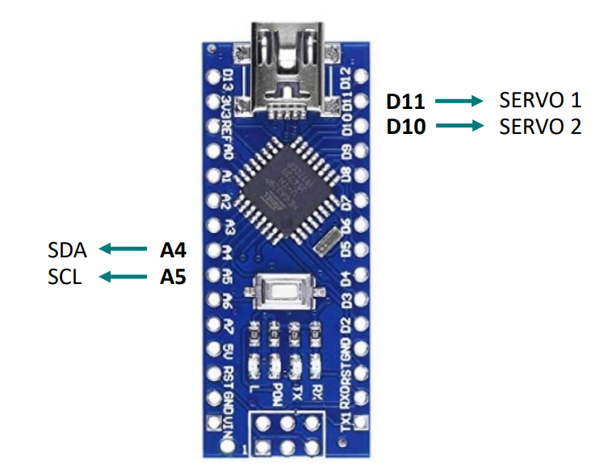

# Gyrobot

Repo du projet de système bouclés du second semestre d'ING2 a l'ECE Paris.

## Objectifs :

- Comprendre le fonctionnement des controleurs PID
- Implémenter un PID fonctionnel dans un robot a 2 roues

## Matériel

- Arduino nano
- 2 servo moteurs FS90R
- centrale inertielle MPU6050

## Exigences Tehniques

✅ **ET1.** La centrale inertielle doit pouvoir mesurer des angles de tangage avec au maximum 2 %
d'erreur.

✅ **ET2.** Le robot doit rester à la verticale pendant au moins 10 secondes avec une amplitude
d'oscillation de maximum ±15°.

✅ **ET3.** Le temps de réponse à 5% et l'erreur statique doivent respectivement
inférieurs à 1ms et 8%.

✅ **ET4.** Tout en restant à la verticale, le robot doit pouvoir se déplacer en ligne droite sur au
moins 80 cm, dans un couloir de 25 cm de large.

❌ **ET5.** Tout en restant à la verticale et en avançant en ligne droite, le robot doit pouvoir se
déplacer à une vitesse rectiligne constante pendant 10 secondes, avec au maximum ±10% de
fluctuation.

## Diagramme synoptique

.

## Pin mapping

.
